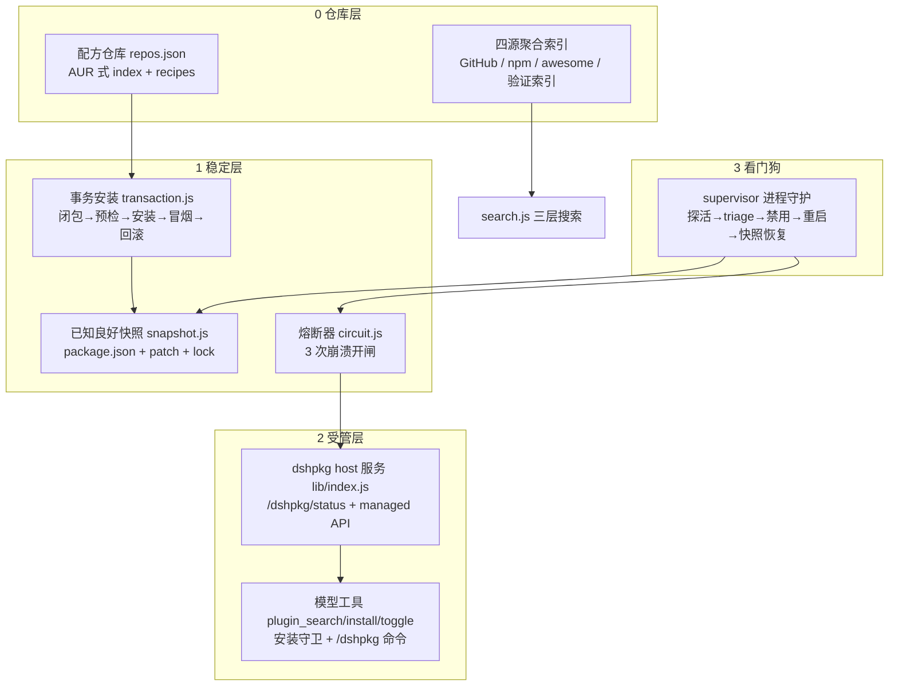

# dshpkg

dshpkg 是 DeepSeek Harness（dsh）的 **apt 风格插件管理器**，也是 dsh 的**自进化基座**：
像 apt 一样用命令管理插件，并在插件把 harness 搞崩时**自动熔断、自动恢复**。

- **仓库层**：AUR 式配方仓库，`dshpkg sync` 一键拉取
- **稳定层**：事务安装（依赖闭包 → 预检 → 安装 → 冒烟，失败自动回滚）+ 已知良好快照
- **受管层**：运行中热挂载 / 卸载插件（L2 host 服务，REST API）
- **看门狗**：进程级守护，崩溃自动禁用肇事条目并重启（L3）

依赖只有官方内核（`@deepseek-ai/cordis` 为 peer），零第三方运行时依赖，纯 ESM。

## 四层架构



- **0 仓库层**：`repo.js` 管理配方仓库（`repo add/remove/list/sync`），`indexer.js` 聚合 GitHub / npm / awesome-dsh-plugin / 验证索引四处数据源
- **1 稳定层**：`transaction.js` 事务安装（失败自动回滚）、`snapshot.js` 已知良好快照、`circuit.js` 崩溃熔断器
- **2 受管层**：`lib/index.js` 是 cordis 宿主插件，提供 `/dshpkg` REST API、热挂载（`managed.js`）、模型工具与安装守卫、Web UI 崩溃横幅
- **3 看门狗**：`bin/supervisor.js` 守护 dsh 进程，启动失败自动 triage、禁用肇事条目并重启；连续失败自动从快照恢复

## 安装

**方式一：npm 全局安装（已发布）**

```powershell
npm install -g @sentencemang/dshpkg@next   # 预发布版本（0.1.0-rc.x）
# 正式版发布后：npm install -g @sentencemang/dshpkg
dshpkg help                    # 验证安装
dshpkg repo init               # 首次使用：添加默认社区仓库
dshpkg update                  # 拉取配方与索引
```

> 包名说明：npm 防混淆策略拒绝裸名 `dshpkg`（与既有包 `sshpk` 拼写相似），
> 故以 scope 包 `@sentencemang/dshpkg` 发布；`dshpkg` 命令名不变。

**方式二：作为 profile 插件挂载（开发/本地）**

dshpkg 以 profile 插件的形式挂载。**本地路径必须使用 `link:` 前缀**（官方 reconciler 只识别带 `link:` 的 bundle 声明，见 CONTRACTS.md 已验证事实）：

```powershell
# 1. 安装到目标 profile（web 为例）
dsh plugin --profile web add "link:C:\path\to\dshpkg"

# 2. 校验组合树（不启动 dsh，退出码 0 = 组合成功）
dsh --profile web --dump-config

# 3. 日常使用
dshpkg sync            # 刷新配方仓库与索引
dshpkg search <关键词> # 搜索插件
dshpkg install <名称>  # 事务安装
```

## AUR 式源码安装

除配方名外，`install` 直接接受 **git 源**——像 AUR 一样直接从源码仓库安装：

| 语法 | 说明 |
| --- | --- |
| `github:owner/repo` | GitHub 仓库简写 |
| `git+https://github.com/owner/repo.git` | 完整 git URL（任意 git 主机均可） |
| `github:owner/repo#path:packages/sub` | monorepo 子包目录 |

```powershell
dshpkg install github:owner/repo
dshpkg install git+https://github.com/owner/repo.git
dshpkg install github:owner/repo#path:packages/sub   # 只装 monorepo 子包
```

**构建**：默认走包自带的 `prepare` 脚本；配方可声明 `build.commands` 自定义构建命令：

```json
{
  "name": "example-plugin",
  "source": "github:owner/repo",
  "build": {
    "commands": ["pnpm install", "pnpm run build"]
  }
}
```

**git 缓存**：源码缓存于 `~/.dsh/dshpkg/cache/git/<name>/`，二次安装走 `git fetch` 快速路径，只拉增量提交。

**allowBuilds 自动处理**：pnpm 默认拦截依赖包的构建脚本；检测到构建被拦时，dshpkg 自动把包名写入 profile 的 `pnpm-workspace.yaml`（`onlyBuiltDependencies`）并重试一次，无需手动 `pnpm approve-builds`。

**网络提示**：GitHub HTTPS 不通时，一行命令全局切 SSH：

```powershell
git config --global url."git@github.com:".insteadOf "https://github.com/"
```

## CLI 命令（31 个命令入口）

| 命令 | 说明 |
| --- | --- |
| `search <关键词>` | 搜索插件（本地索引；`--online` 联网 GitHub/npm） |
| `install <名称>` | 事务安装：闭包→预检→信任闸门→安装→冒烟，失败自动回滚 |
| `remove <名称>` | 卸载插件 |
| `update` / `sync` | 同步配方仓库并刷新插件索引（apt update 语义） |
| `upgrade [名称]` | 升级全部或指定插件到最新版本 |
| `self-upgrade [版本]` | 事务化升级 dshpkg 自身（快照 + 冒烟，失败自动回退） |
| `hold <名称>` | 保持当前版本（upgrade 跳过它） |
| `unhold <名称>` | 取消保持 |
| `enable <名称>` | 启用插件（移除 cordis.patch.yml 禁用块） |
| `disable <名称>` | 禁用插件（追加 cordis.patch.yml 禁用块） |
| `status <名称>` | 插件状态：running / disabled / circuit-open |
| `list` | 列出插件（`--installed` 仅看已安装） |
| `info <名称>` | 配方详情、依赖与崩溃计数 |
| `why <名称>` | 依赖反查：哪些配方依赖它 |
| `doctor [--fix]` | 校验组合树与依赖图（`--fix` 自动安装缺失依赖） |
| `autoremove` | 清理孤儿包（卸载插件的残留依赖；`--dry-run` 演练） |
| `audit` | 最近 20 条崩溃记录 + 电路状态汇总 |
| `fix-broken` | 交互式修复 circuit-open 的插件 |
| `log` | 输出崩溃事件流（incidents.jsonl） |
| `run` | 启动看门狗守护 dsh（`--port N` / `--profile 名`） |
| `daemon install/uninstall/status` | 注册/注销/查询看门狗计划任务（Windows 计划任务，每 5 分钟拉起） |
| `repo init [--no-default]` | 首次使用：一键添加默认社区仓库 |
| `repo add <url> [名称] [--format git\|index]` | 添加配方仓库（`--format index` = 发布者静态索引源） |
| `repo remove/list` | 移除 / 列出配方仓库 |
| `key add/list/remove` | 信任 / 列出 / 移除 minisign 公钥（配方签名验签） |
| `optimize [--apply]` | 性能诊断：测量组合耗时、标记高负载/不稳定插件、报告缓存占用；`--apply` 自动禁用不稳定插件 |
| `help` | 显示帮助 |

常用选项：`--online`（search 联网）、`--dry-run`（只演练不改动）、`--profile <名>`、`--port <N>`、`--yes`（非交互确认）。

## 配方签名与信任（minisign）

配方可携带 `signatures.minisign`（Ed25519，一期；SSH 槽位预留）。验签基于**发布原文的 canonical JSON**（键序排序、无空白），与 `validateRecipe` 的默认填充无关：

- 签名有效且公钥可信 → `install` 自动放行（展示 ✓）；
- 签名无效 → **拒绝安装**（`--yes` 也不放行，fail-closed）；
- 未签名 → 交互确认（回车=确认）或 `--yes`；`pin.allow` 的配方按仓库级信任提示后放行；
- 公钥来源：仓库 `pubkeys/<keyId>.pub`（sync 时缓存）或 `dshpkg key add` 显式信任集。

## 自愈机制（三层熔断）

1. **L2 熔断器**：`circuit.js` 记录每次崩溃；10 分钟窗口内 3 次 → 电路打开（`circuit-open`），`dshpkg audit` / Web UI 横幅可见，`dshpkg fix-broken` 或 REST `POST /dshpkg/circuit/close` 手动恢复
2. **L3 看门狗**：`dshpkg run` 守护 dsh —— 启动失败时用 triage 正则解析 stderr 定位肇事条目，在 `cordis.patch.yml` 写入 `dshpkg:managed` 禁用块后重启；连续 3 次失败自动从最新快照恢复
3. **核心保护名单**：`loader` / `include` / `cordis-host-runner` 等核心条目**永不熔断**——熔断核心只会让 harness 彻底无法启动，因此 host 服务与看门狗都会拒绝（`protected-blocked` 事件）

自愈的每一步都会写入事件流（`incidents.jsonl`），`dshpkg log` 随时可查。

## 性能优化（optimize）

`dshpkg optimize` 用于诊断 dsh 使用中的卡顿，定位高负载与不稳定的插件，并可选自动禁用它们：

- **用法**：`dshpkg optimize`（只诊断，不改动）；`dshpkg optimize --apply`（诊断 + 自动禁用不稳定插件）
- **做了什么**：
  - 测量 dsh 组合耗时（`--dump-config`，只组合不启动，安全）
  - 按稳定性/体积给插件打分：熔断（circuit-open +60 分）、崩溃次数、体积 ≥20MB 加重
  - 缓存占用分解：快照 / git / managed / index
  - 标记不稳定插件（circuit-open 或崩溃 ≥3 次）
- **安全与可逆**：`--apply` 只写 `cordis.patch.yml` 禁用块，**不做删除/卸载**；核心保护名单条目永不禁用；恢复用 `dshpkg enable <名称>`
- **与其它命令的分工**：`audit` 看崩溃记录、`optimize` 看性能与负载、`doctor` 校验依赖

## 模型工具与安装守卫

dshpkg 在宿主内注册 3 个模型工具，让 AI 智能体以受控方式操作插件：

- `plugin_search(query)` — 离线本地索引搜索，返回前 10 条中文摘要
- `plugin_install(name)` — 走事务安装（预检 + 回滚），杜绝裸命令
- `plugin_toggle(name)` — 按当前状态翻转启用/禁用（核心条目受保护）

同时向系统提示词注入**安装守卫**规则：插件安装必须走 dshpkg CLI 或 `plugin_*` 工具，**禁止直接执行裸 `dsh plugin` / `pnpm add` 命令**；并提供 `/dshpkg` 斜杠命令（search / install / toggle 子命令）。这些注册全部防御式：服务缺失或接口形状不符时静默跳过，绝不影响宿主启动。

## 状态目录

所有状态都在 `~/.dsh/dshpkg/`（可用 `DSH_PKG_HOME` 覆盖）：

```
~/.dsh/dshpkg/
├── state.json          # 插件簿记、崩溃计数、电路状态（R8 单一事实源）
├── incidents.jsonl     # 崩溃事件流（dshpkg log / audit 的数据源）
├── repos.json          # 配方仓库列表（优先级 = 顺序）
├── recipes/<name>/     # sync 下来的配方仓库
├── index/              # 四源聚合索引（items.json + meta.json）
├── snapshots/          # 已知良好快照（保留最近 5 个，最新优先）
└── managed/<name>/     # L2 受管条目（index.mjs + manifest.json + seq.json）
```

写操作全部原子化（同目录 tmp + rename，Windows 兼容，见 CONTRACTS.md R1）。

## 诚实边界

- **依赖官方通道**：安装/卸载经由 `dsh plugin --profile <name> add/remove`，dshpkg 不绕过官方 reconciler；本地路径必须 `link:` 前缀，否则 bundle 检测失败
- **单机本地设计**：状态与快照都在本机 `~/.dsh/dshpkg/`，没有多机同步、没有签名验证基础设施；配方仓库内容靠仓库所有者的责任
- **搜索默认离线**：`search` 只查本地索引，数据新不新取决于 `sync` 频率；`--online` 才联网，且联网失败静默回退本地索引
- **自愈是尽力而为**：triage 依赖 dsh 固定的启动错误格式（CONTRACTS.md 已验证）；格式变化或非 loader 原因的崩溃（如端口占用）无法自动归因，看门狗会不断重启直到人工介入
- **熔断不等于修复**：circuit-open 只是停止反复崩溃，`fix-broken` / 升级 / 卸载仍需人工决策
- **模型工具是受控通道**：`plugin_install` 走完整事务（含预检回滚），但智能体仍可能通过普通 shell 工具绕过守卫——安装守卫是提示词级约束，不是沙箱级强制

## 开发

```powershell
node --check lib/index.js bin/dshpkg.js bin/supervisor.js  # 语法检查
node --test                                                # 单元测试（零联网）
```

测试约定：全部注入 fake（runner / fetcher / spawn / probe / clock），临时目录隔离状态，**绝不触碰真实 profile**。契约与裁决见 `CONTRACTS.md`。

## License

[MIT](./LICENSE)
